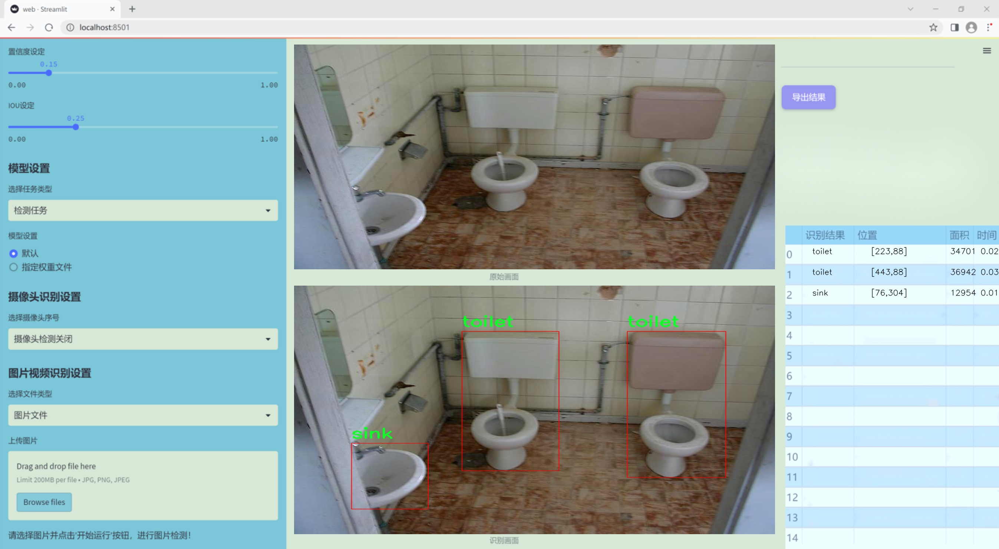
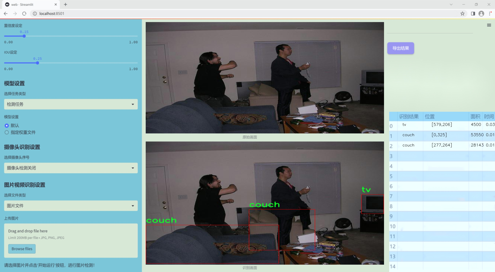
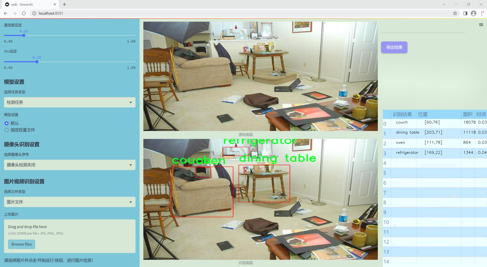
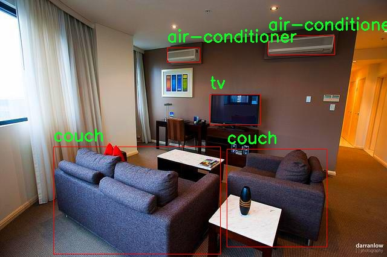
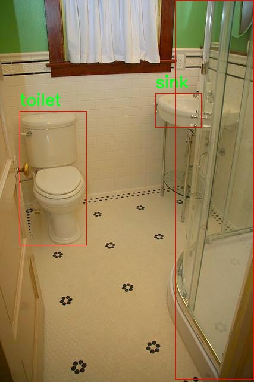
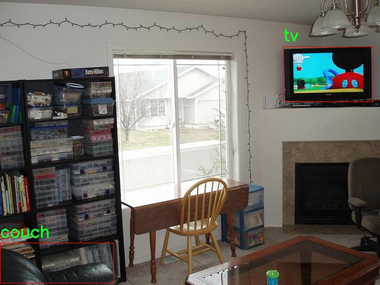
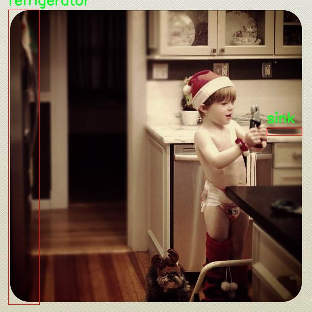

# 改进yolo11-iRMB等200+全套创新点大全：厨房电器检测系统源码＆数据集全套

### 1.图片效果展示







##### 项目来源 **[人工智能促进会 2024.11.03](https://kdocs.cn/l/cszuIiCKVNis)**

注意：由于项目一直在更新迭代，上面“1.图片效果展示”和“2.视频效果展示”展示的系统图片或者视频可能为老版本，新版本在老版本的基础上升级如下：（实际效果以升级的新版本为准）

  （1）适配了YOLOV11的“目标检测”模型和“实例分割”模型，通过加载相应的权重（.pt）文件即可自适应加载模型。

  （2）支持“图片识别”、“视频识别”、“摄像头实时识别”三种识别模式。

  （3）支持“图片识别”、“视频识别”、“摄像头实时识别”三种识别结果保存导出，解决手动导出（容易卡顿出现爆内存）存在的问题，识别完自动保存结果并导出到tempDir中。

  （4）支持Web前端系统中的标题、背景图等自定义修改。

  另外本项目提供训练的数据集和训练教程,暂不提供权重文件（best.pt）,需要您按照教程进行训练后实现图片演示和Web前端界面演示的效果。

### 2.视频效果展示

[2.1 视频效果展示](https://www.bilibili.com/video/BV16kDEY9E1Y/)

### 3.背景

研究背景与意义

随着智能家居的快速发展，厨房电器的智能化和自动化程度不断提高，厨房作为家庭生活的重要场所，其电器设备的种类和数量也日益增加。为了提升厨房电器的管理和使用效率，基于计算机视觉的自动检测系统应运而生。近年来，YOLO（You Only Look Once）系列模型因其在实时目标检测中的优越性能而受到广泛关注。YOLOv11作为该系列的最新版本，具备更高的检测精度和更快的处理速度，适合应用于厨房电器的智能识别。

本研究旨在基于改进的YOLOv11模型，构建一个高效的厨房电器检测系统。我们使用的数据集包含2600张图像，涵盖了多种厨房电器，如电冰箱、微波炉、洗碗机等，分类数量达到2类。通过对这些图像的深入分析与处理，系统能够准确识别并定位厨房中的各类电器，进而为用户提供实时监控和管理功能。

该系统的实现不仅能够提升厨房电器的使用便捷性，还能为智能家居系统的进一步发展奠定基础。通过对厨房电器的实时监测，用户可以及时获取设备的状态信息，优化能源使用，减少不必要的浪费。此外，该研究还将为相关领域的研究者提供宝贵的数据和技术支持，推动计算机视觉技术在家庭生活中的应用。因此，基于改进YOLOv11的厨房电器检测系统的研究具有重要的理论价值和实际意义。

### 4.数据集信息展示

##### 4.1 本项目数据集详细数据（类别数＆类别名）

nc: 18
names: ['air-conditioner', 'bath', 'boiler', 'couch', 'dining table', 'dishwasher', 'double bed', 'electric stove', 'gas stove', 'microwave', 'oven', 'refrigerator', 'shower', 'single bed', 'sink', 'toilet', 'tv', 'washing machine']


该项目为【目标检测】数据集，请在【训练教程和Web端加载模型教程（第三步）】这一步的时候按照【目标检测】部分的教程来训练

##### 4.2 本项目数据集信息介绍

本项目数据集信息介绍

本项目旨在改进YOLOv11的厨房电器检测系统，所使用的数据集名为“targetv3”。该数据集专门针对厨房及相关家居环境中的电器和家具进行标注，涵盖了18个不同的类别。这些类别包括：空调、浴缸、锅炉、沙发、餐桌、洗碗机、双人床、电炉、燃气灶、微波炉、烤箱、冰箱、淋浴、单人床、水槽、马桶、电视以及洗衣机。通过这些多样化的类别，数据集能够为模型提供丰富的训练样本，确保其在实际应用中具备良好的泛化能力。

“targetv3”数据集的构建过程注重了样本的多样性和真实性，确保每个类别的样本均能反映出其在现实生活中的实际应用场景。这不仅有助于提高模型对不同厨房电器的识别精度，还能增强其在复杂环境下的适应能力。数据集中每个类别的样本均经过精确标注，包含了不同角度、光照条件及背景的图像，力求在训练过程中覆盖尽可能多的变化情况，以提升模型的鲁棒性。

此外，数据集的设计考虑到了实际应用中的挑战，例如厨房空间的拥挤程度和电器的多样化布局，这使得模型在面对真实世界的厨房环境时，能够更有效地进行物体检测和分类。通过使用“targetv3”数据集，改进后的YOLOv11模型将能够在厨房电器检测任务中展现出更高的准确性和效率，为智能家居的实现提供强有力的技术支持。










### 5.全套项目环境部署视频教程（零基础手把手教学）

[5.1 所需软件PyCharm和Anaconda安装教程（第一步）](https://www.bilibili.com/video/BV1BoC1YCEKi/?spm_id_from=333.999.0.0&vd_source=bc9aec86d164b67a7004b996143742dc)


[5.2 安装Python虚拟环境创建和依赖库安装视频教程（第二步）](https://www.bilibili.com/video/BV1ZoC1YCEBw?spm_id_from=333.788.videopod.sections&vd_source=bc9aec86d164b67a7004b996143742dc)

### 6.改进YOLOv11训练教程和Web_UI前端加载模型教程（零基础手把手教学）

[6.1 改进YOLOv11训练教程和Web_UI前端加载模型教程（第三步）](https://www.bilibili.com/video/BV1BoC1YCEhR?spm_id_from=333.788.videopod.sections&vd_source=bc9aec86d164b67a7004b996143742dc)


按照上面的训练视频教程链接加载项目提供的数据集，运行train.py即可开始训练



     Epoch   gpu_mem       box       obj       cls    labels  img_size
     1/200     20.8G   0.01576   0.01955  0.007536        22      1280: 100%|██████████| 849/849 [14:42<00:00,  1.04s/it]
               Class     Images     Labels          P          R     mAP@.5 mAP@.5:.95: 100%|██████████| 213/213 [01:14<00:00,  2.87it/s]
                 all       3395      17314      0.994      0.957      0.0957      0.0843

     Epoch   gpu_mem       box       obj       cls    labels  img_size
     2/200     20.8G   0.01578   0.01923  0.007006        22      1280: 100%|██████████| 849/849 [14:44<00:00,  1.04s/it]
               Class     Images     Labels          P          R     mAP@.5 mAP@.5:.95: 100%|██████████| 213/213 [01:12<00:00,  2.95it/s]
                 all       3395      17314      0.996      0.956      0.0957      0.0845

     Epoch   gpu_mem       box       obj       cls    labels  img_size
     3/200     20.8G   0.01561    0.0191  0.006895        27      1280: 100%|██████████| 849/849 [10:56<00:00,  1.29it/s]
               Class     Images     Labels          P          R     mAP@.5 mAP@.5:.95: 100%|███████   | 187/213 [00:52<00:00,  4.04it/s]
                 all       3395      17314      0.996      0.957      0.0957      0.0845


###### [项目数据集下载链接](https://kdocs.cn/l/cszuIiCKVNis)

### 7.原始YOLOv11算法讲解


YOLO11 是 Ultralytics YOLO 系列的最新版本，结合了尖端的准确性、速度和效率，用于目标检测、分割、分类、定向边界框和姿态估计。与
YOLOv8 相比，它具有更少的参数和更好的结果，不难预见，YOLO11 在边缘设备上更高效、更快，将频繁出现在计算机视觉领域的最先进技术（SOTA）中。


**主要特点**

  * **增强的特征提取：**YOLO11 使用改进的主干和颈部架构来增强特征提取，以实现更精确的目标检测和复杂任务的性能。

  * **针对效率和速度优化：**精细的架构设计和优化的训练流程在保持准确性和性能之间最佳平衡的同时，提供更快的处理速度。

  * **更少的参数，更高的准确度：**YOLO11m 在 COCO 数据集上实现了比 YOLOv8m 更高的 mAP，参数减少了 22%，提高了计算效率，同时不牺牲准确度。

  * **跨环境的适应性：**YOLO11 可以无缝部署在边缘设备、云平台和配备 NVIDIA GPU 的系统上，确保最大的灵活性。

  * **支持广泛的任务范围：**YOLO11 支持各种计算机视觉任务，如目标检测、实例分割、图像分类、姿态估计和定向目标检测（OBB）。


### 8.200+种全套改进YOLOV11创新点原理讲解

#### 8.1 200+种全套改进YOLOV11创新点原理讲解大全

由于篇幅限制，每个创新点的具体原理讲解就不全部展开，具体见下列网址中的改进模块对应项目的技术原理博客网址【Blog】（创新点均为模块化搭建，原理适配YOLOv5~YOLOv11等各种版本）

[改进模块技术原理博客【Blog】网址链接](https://gitee.com/qunmasj/good)


#### 8.2 精选部分改进YOLOV11创新点原理讲解

###### 这里节选部分改进创新点展开原理讲解(完整的改进原理见上图和[改进模块技术原理博客链接](https://gitee.com/qunmasj/good)【如果此小节的图加载失败可以通过CSDN或者Github搜索该博客的标题访问原始博客，原始博客图片显示正常】
### CBAM空间注意力机制
近年来，随着深度学习研究方向的火热，注意力机制也被广泛地应用在图像识别、语音识别和自然语言处理等领域，注意力机制在深度学习任务中发挥着举足轻重的作用。注意力机制借鉴于人类的视觉系统，例如，人眼在看到一幅画面时，会倾向于关注画面中的重要信息，而忽略其他可见的信息。深度学习中的注意力机制和人类视觉的注意力机制相似，通过扫描全局数据，从大量数据中选择出需要重点关注的、对当前任务更为重要的信息，然后对这部分信息分配更多的注意力资源，从这些信息中获取更多所需要的细节信息，而抑制其他无用的信息。而在深度学习中，则具体表现为给感兴趣的区域更高的权重，经过网络的学习和调整，得到最优的权重分配，形成网络模型的注意力，使网络拥有更强的学习能力，加快网络的收敛速度。
注意力机制通常可分为软注意力机制和硬注意力机制[4-5]。软注意力机制在选择信息时，不是从输入的信息中只选择1个，而会用到所有输入信息，只是各个信息对应的权重分配不同，然后输入网络模型进行计算;硬注意力机制则是从输入的信息中随机选取一个或者选择概率最高的信息，但是这一步骤通常是不可微的，导致硬注意力机制更难训练。因此，软注意力机制应用更为广泛，按照原理可将软注意力机制划分为:通道注意力机制（channel attention)、空间注意力机制(spatial attention）和混合域注意力机制(mixed attention)。
通道注意力机制的本质建立各个特征通道之间的重要程度，对感兴趣的通道进行重点关注，弱化不感兴趣的通道的作用;空间注意力的本质则是建模了整个空间信息的重要程度，然后对空间内感兴趣的区域进行重点关注，弱化其余非感兴趣区域的作用;混合注意力同时运用了通道注意力和空间注意力，两部分先后进行或并行，形成对通道特征和空间特征同时关注的注意力模型。

卷积层注意力模块(Convolutional Block Attention Module，CBAM）是比较常用的混合注意力模块，其先后集中了通道注意力模块和空间注意力模块，网络中加入该模块能有效提高网络性能，减少网络模型的计算量，模块结构如图所示。输入特征图首先经过分支的通道注意力模块，然后和主干的原特征图融合，得到具有通道注意力的特征图，接着经过分支的空间注意力模块，在和主干的特征图融合后，得到同时具有通道特征注意力和空间特征注意力的特征图。CBAM模块不改变输入特征图的大小，因此该模块是一个“即插即用”的模块，可以插入网络的任何位置。

通道注意力模块的结构示意图如图所示，通道注意力模块分支并行地对输入的特征图进行最大池化操作和平均池化操作，然后利用多层感知机对结果进行变换，得到应用于两个通道的变换结果，最后经过sigmoid激活函数将变换结果融合，得到具有通道注意力的通道特征图。

空间注意力模块示意图如图所示，将通道注意力模块输出的特征图作为该模块的输入特征图，首先对输入特征图进行基于通道的最大池化操作和平均池化操作，将两部分得到的结果拼接起来，然后通过卷积得到降为Ⅰ通道的特征图，最后通过sigmoid激活函数生成具有空间注意力的特征图。


### 9.系统功能展示

图9.1.系统支持检测结果表格显示

  图9.2.系统支持置信度和IOU阈值手动调节

  图9.3.系统支持自定义加载权重文件best.pt(需要你通过步骤5中训练获得)

  图9.4.系统支持摄像头实时识别

  图9.5.系统支持图片识别

  图9.6.系统支持视频识别

  图9.7.系统支持识别结果文件自动保存

  图9.8.系统支持Excel导出检测结果数据


### 10. YOLOv11核心改进源码讲解

#### 10.1 mobilenetv4.py

以下是对代码的核心部分进行提炼和详细注释的结果：

```python
import torch
import torch.nn as nn

# 定义 MobileNetV4 的模型规格，包括不同大小的模型
MODEL_SPECS = {
    "MobileNetV4ConvSmall": MNV4ConvSmall_BLOCK_SPECS,
    "MobileNetV4ConvMedium": MNV4ConvMedium_BLOCK_SPECS,
    "MobileNetV4ConvLarge": MNV4ConvLarge_BLOCK_SPECS,
    "MobileNetV4HybridMedium": MNV4HybridConvMedium_BLOCK_SPECS,
    "MobileNetV4HybridLarge": MNV4HybridConvLarge_BLOCK_SPECS,
}

def conv_2d(inp, oup, kernel_size=3, stride=1, groups=1, bias=False, norm=True, act=True):
    """
    创建一个2D卷积层，包含卷积、批归一化和激活函数。
    
    Args:
        inp: 输入通道数
        oup: 输出通道数
        kernel_size: 卷积核大小
        stride: 步幅
        groups: 分组卷积
        bias: 是否使用偏置
        norm: 是否使用批归一化
        act: 是否使用激活函数

    Returns:
        nn.Sequential: 包含卷积层的序列
    """
    conv = nn.Sequential()
    padding = (kernel_size - 1) // 2  # 计算填充
    conv.add_module('conv', nn.Conv2d(inp, oup, kernel_size, stride, padding, bias=bias, groups=groups))
    if norm:
        conv.add_module('BatchNorm2d', nn.BatchNorm2d(oup))  # 添加批归一化
    if act:
        conv.add_module('Activation', nn.ReLU6())  # 添加ReLU6激活函数
    return conv

class InvertedResidual(nn.Module):
    """
    反向残差块，包含扩展卷积和深度卷积。
    """
    def __init__(self, inp, oup, stride, expand_ratio, act=False):
        super(InvertedResidual, self).__init__()
        self.stride = stride
        hidden_dim = int(round(inp * expand_ratio))  # 计算隐藏层的通道数
        self.block = nn.Sequential()
        
        # 如果扩展比不为1，添加1x1卷积进行扩展
        if expand_ratio != 1:
            self.block.add_module('exp_1x1', conv_2d(inp, hidden_dim, kernel_size=1, stride=1))
        
        # 添加深度卷积
        self.block.add_module('conv_3x3', conv_2d(hidden_dim, hidden_dim, kernel_size=3, stride=stride, groups=hidden_dim))
        
        # 添加1x1卷积进行降维
        self.block.add_module('red_1x1', conv_2d(hidden_dim, oup, kernel_size=1, stride=1, act=act))
        
        # 判断是否使用残差连接
        self.use_res_connect = self.stride == 1 and inp == oup

    def forward(self, x):
        if self.use_res_connect:
            return x + self.block(x)  # 使用残差连接
        else:
            return self.block(x)

class MobileNetV4(nn.Module):
    """
    MobileNetV4模型的实现，包含多个卷积层和反向残差块。
    """
    def __init__(self, model):
        super().__init__()
        assert model in MODEL_SPECS.keys()  # 确保模型名称有效
        self.model = model
        self.spec = MODEL_SPECS[self.model]
       
        # 根据模型规格构建各层
        self.conv0 = build_blocks(self.spec['conv0'])
        self.layer1 = build_blocks(self.spec['layer1'])
        self.layer2 = build_blocks(self.spec['layer2'])
        self.layer3 = build_blocks(self.spec['layer3'])
        self.layer4 = build_blocks(self.spec['layer4'])
        self.layer5 = build_blocks(self.spec['layer5'])
        self.features = nn.ModuleList([self.conv0, self.layer1, self.layer2, self.layer3, self.layer4, self.layer5])     

    def forward(self, x):
        features = [None, None, None, None]  # 存储特征图
        for f in self.features:
            x = f(x)  # 通过每一层
            # 根据输入大小选择特征图
            if x.size(2) in [x.size(2) // 4, x.size(2) // 8, x.size(2) // 16, x.size(2) // 32]:
                features[x.size(2) // x.size(2)] = x
        return features

# 各种模型的构建函数
def MobileNetV4ConvSmall():
    return MobileNetV4('MobileNetV4ConvSmall')

def MobileNetV4ConvMedium():
    return MobileNetV4('MobileNetV4ConvMedium')

def MobileNetV4ConvLarge():
    return MobileNetV4('MobileNetV4ConvLarge')

def MobileNetV4HybridMedium():
    return MobileNetV4('MobileNetV4HybridMedium')

def MobileNetV4HybridLarge():
    return MobileNetV4('MobileNetV4HybridLarge')

if __name__ == '__main__':
    model = MobileNetV4ConvSmall()  # 实例化小型MobileNetV4模型
    inputs = torch.randn((1, 3, 640, 640))  # 随机输入
    res = model(inputs)  # 前向传播
    for i in res:
        print(i.size())  # 打印输出特征图的尺寸
```

### 代码核心部分分析
1. **模型规格定义**：通过字典 `MODEL_SPECS` 定义了不同类型的 MobileNetV4 模型的结构。
2. **卷积层构建**：`conv_2d` 函数用于构建包含卷积、批归一化和激活函数的层。
3. **反向残差块**：`InvertedResidual` 类实现了 MobileNetV4 中的反向残差块，支持扩展和深度卷积。
4. **模型主类**：`MobileNetV4` 类负责构建整个网络结构，并实现前向传播逻辑。
5. **模型实例化**：提供了多种模型的构建函数，便于创建不同规模的 MobileNetV4 模型。

以上是对代码的核心部分进行提炼和详细注释的结果，旨在帮助理解 MobileNetV4 的实现逻辑。

这个文件定义了一个名为 `MobileNetV4` 的深度学习模型，主要用于图像分类等计算机视觉任务。它是 MobileNet 系列的一个变种，旨在通过轻量级的网络结构来提高计算效率和减少模型大小。

首先，文件中导入了一些必要的库，包括 `torch` 和 `torch.nn`，这些是 PyTorch 框架中用于构建神经网络的基本组件。接着，定义了一些模型的规格，包括不同大小的 MobileNetV4 变体（小型、中型、大型和混合型）。这些规格以字典的形式存储，包含了每一层的具体配置，比如卷积层的数量、输入输出通道数、卷积核大小、步幅等。

`make_divisible` 函数用于确保网络中的通道数是 8 的倍数，这是为了提高计算效率。该函数接收一个值和一个除数，返回一个调整后的值，使其满足可被除数整除的条件。

`conv_2d` 函数用于构建一个包含卷积层、批归一化层和激活函数的序列模块。这个函数接收输入通道数、输出通道数、卷积核大小、步幅等参数，并根据这些参数构建一个卷积层。

`InvertedResidual` 类实现了反向残差块，这是 MobileNet 结构的核心部分。该类通过一系列卷积操作来处理输入，并根据需要添加残差连接。它的构造函数中定义了输入输出通道、步幅和扩展比等参数。

`UniversalInvertedBottleneckBlock` 类是一个通用的反向瓶颈块，类似于 `InvertedResidual`，但支持更多的卷积配置。它的构造函数允许用户定义多个卷积层的参数，包括起始深度卷积、扩展卷积和投影卷积。

`build_blocks` 函数根据层的规格构建相应的网络模块。它根据不同的块名称（如 `convbn`、`uib` 和 `fused_ib`）来创建不同类型的层，并将它们组合成一个序列。

`MobileNetV4` 类是整个模型的核心，构造函数接收一个模型名称并根据该名称构建相应的网络结构。它使用 `build_blocks` 函数构建各个层，并将它们存储在一个模块列表中。`forward` 方法定义了前向传播的过程，处理输入数据并返回特征图。

最后，文件提供了一些便捷的函数（如 `MobileNetV4ConvSmall`、`MobileNetV4ConvMedium` 等）来快速实例化不同配置的 MobileNetV4 模型。在主程序中，创建了一个小型 MobileNetV4 模型并对随机生成的输入进行前向传播，输出每一层的特征图大小。

整体而言，这个文件实现了一个灵活且高效的 MobileNetV4 模型，适用于各种计算机视觉任务。

#### 10.2 kagn_conv.py

以下是代码中最核心的部分，并附上详细的中文注释：

```python
import torch
import torch.nn as nn
from functools import lru_cache

class KAGNConvNDLayer(nn.Module):
    def __init__(self, conv_class, norm_class, conv_w_fun, input_dim, output_dim, degree, kernel_size,
                 groups=1, padding=0, stride=1, dilation=1, dropout: float = 0.0, ndim: int = 2):
        super(KAGNConvNDLayer, self).__init__()
        
        # 初始化参数
        self.inputdim = input_dim  # 输入维度
        self.outdim = output_dim    # 输出维度
        self.degree = degree         # 多项式的度数
        self.kernel_size = kernel_size  # 卷积核大小
        self.padding = padding       # 填充
        self.stride = stride         # 步幅
        self.dilation = dilation     # 膨胀
        self.groups = groups         # 分组卷积的组数
        self.base_activation = nn.SiLU()  # 基础激活函数
        self.conv_w_fun = conv_w_fun  # 卷积权重函数
        self.ndim = ndim             # 数据的维度
        self.dropout = None          # Dropout层

        # 根据维度初始化Dropout层
        if dropout > 0:
            if ndim == 1:
                self.dropout = nn.Dropout1d(p=dropout)
            elif ndim == 2:
                self.dropout = nn.Dropout2d(p=dropout)
            elif ndim == 3:
                self.dropout = nn.Dropout3d(p=dropout)

        # 检查分组卷积的有效性
        if groups <= 0:
            raise ValueError('groups must be a positive integer')
        if input_dim % groups != 0:
            raise ValueError('input_dim must be divisible by groups')
        if output_dim % groups != 0:
            raise ValueError('output_dim must be divisible by groups')

        # 初始化基础卷积层和归一化层
        self.base_conv = nn.ModuleList([conv_class(input_dim // groups,
                                                   output_dim // groups,
                                                   kernel_size,
                                                   stride,
                                                   padding,
                                                   dilation,
                                                   groups=1,
                                                   bias=False) for _ in range(groups)])

        self.layer_norm = nn.ModuleList([norm_class(output_dim // groups) for _ in range(groups)])

        # 初始化多项式权重
        poly_shape = (groups, output_dim // groups, (input_dim // groups) * (degree + 1)) + tuple(
            kernel_size for _ in range(ndim))

        self.poly_weights = nn.Parameter(torch.randn(*poly_shape))  # 多项式权重
        self.beta_weights = nn.Parameter(torch.zeros(degree + 1, dtype=torch.float32))  # beta权重

        # 使用Kaiming均匀分布初始化权重
        for conv_layer in self.base_conv:
            nn.init.kaiming_uniform_(conv_layer.weight, nonlinearity='linear')

        nn.init.kaiming_uniform_(self.poly_weights, nonlinearity='linear')
        nn.init.normal_(
            self.beta_weights,
            mean=0.0,
            std=1.0 / ((kernel_size ** ndim) * self.inputdim * (self.degree + 1.0)),
        )

    def beta(self, n, m):
        # 计算beta值，用于Legendre多项式
        return (
            ((m + n) * (m - n) * n ** 2) / (m ** 2 / (4.0 * n ** 2 - 1.0))
        ) * self.beta_weights[n]

    @lru_cache(maxsize=128)  # 使用缓存避免重复计算Legendre多项式
    def gram_poly(self, x, degree):
        # 计算Legendre多项式
        p0 = x.new_ones(x.size())  # p0初始化为1

        if degree == 0:
            return p0.unsqueeze(-1)

        p1 = x  # p1初始化为x
        grams_basis = [p0, p1]  # 存储多项式基

        for i in range(2, degree + 1):
            p2 = x * p1 - self.beta(i - 1, i) * p0  # 递归计算多项式
            grams_basis.append(p2)
            p0, p1 = p1, p2  # 更新p0和p1

        return torch.cat(grams_basis, dim=1)  # 连接多项式基

    def forward_kag(self, x, group_index):
        # 前向传播，处理每个组的输入
        basis = self.base_conv[group_index](self.base_activation(x))  # 基础卷积层的输出

        # 将x归一化到[-1, 1]范围
        x = torch.tanh(x).contiguous()

        if self.dropout is not None:
            x = self.dropout(x)  # 应用Dropout

        grams_basis = self.base_activation(self.gram_poly(x, self.degree))  # 计算Gram多项式基

        # 使用卷积权重函数计算输出
        y = self.conv_w_fun(grams_basis, self.poly_weights[group_index],
                            stride=self.stride, dilation=self.dilation,
                            padding=self.padding, groups=1)

        y = self.base_activation(self.layer_norm[group_index](y + basis))  # 归一化并激活

        return y

    def forward(self, x):
        # 前向传播，处理所有组的输入
        split_x = torch.split(x, self.inputdim // self.groups, dim=1)  # 按组分割输入
        output = []
        for group_ind, _x in enumerate(split_x):
            y = self.forward_kag(_x.clone(), group_ind)  # 处理每个组
            output.append(y.clone())
        y = torch.cat(output, dim=1)  # 连接所有组的输出
        return y
```

### 代码核心部分解释：
1. **KAGNConvNDLayer**: 这是一个通用的卷积层类，支持任意维度的卷积（1D、2D、3D），使用Legendre多项式作为激活函数。
2. **参数初始化**: 在构造函数中，初始化了输入输出维度、卷积参数、Dropout层等，并对权重进行了Kaiming初始化，以便更好地开始训练。
3. **Legendre多项式计算**: `gram_poly`方法计算Legendre多项式，使用了递归的方法，并利用`lru_cache`来缓存结果以提高效率。
4. **前向传播**: `forward_kag`方法处理每个组的输入，应用卷积、激活和归一化操作，`forward`方法则负责处理所有组的输入并返回最终输出。

这个程序文件 `kagn_conv.py` 定义了一系列用于卷积神经网络的自定义层，主要是基于 KAGN（Kochawongwat 等人提出的模型）的方法。文件中包含了一个基类 `KAGNConvNDLayer` 和三个子类 `KAGNConv3DLayer`、`KAGNConv2DLayer` 和 `KAGNConv1DLayer`，分别用于处理三维、二维和一维卷积。

在 `KAGNConvNDLayer` 类的构造函数中，首先初始化了一些参数，包括输入和输出维度、卷积核大小、步幅、填充、扩张率、组数、丢弃率等。接着，使用 `nn.ModuleList` 创建了基础卷积层和归一化层，这些层的数量与组数相同。该类还定义了多项式权重和 beta 权重，这些权重会在后续的计算中使用。

`beta` 方法用于计算与 Legendre 多项式相关的权重，`gram_poly` 方法则用于生成 Legendre 多项式的基函数，使用了缓存机制以提高效率。`forward_kag` 方法实现了前向传播的逻辑，首先对输入进行基础激活，然后通过基础卷积层进行线性变换，再计算 Gram 多项式的基函数，最后结合基础卷积的输出和归一化层的输出，得到最终的结果。

`forward` 方法负责处理输入数据，将其分割成多个组，并对每个组调用 `forward_kag` 方法进行处理，最后将所有组的输出拼接在一起。

子类 `KAGNConv3DLayer`、`KAGNConv2DLayer` 和 `KAGNConv1DLayer` 继承自 `KAGNConvNDLayer`，分别为三维、二维和一维卷积层提供了具体的实现。它们在初始化时指定了相应的卷积类和归一化类，以便于处理不同维度的数据。

整体来看，这个文件实现了一个灵活且高效的卷积层结构，能够处理多种维度的数据，并结合了 Legendre 多项式的特性，适用于需要复杂特征提取的深度学习任务。

#### 10.3 kernel_warehouse.py

以下是代码中最核心的部分，并附上详细的中文注释：

```python
import torch
import torch.nn as nn
import torch.nn.functional as F

class Attention(nn.Module):
    def __init__(self, in_planes, reduction, num_static_cell, num_local_mixture, norm_layer=nn.BatchNorm1d,
                 cell_num_ratio=1.0, nonlocal_basis_ratio=1.0, start_cell_idx=None):
        super(Attention, self).__init__()
        # 计算隐藏层的通道数
        hidden_planes = max(int(in_planes * reduction), 16)
        self.kw_planes_per_mixture = num_static_cell + 1  # 每个混合物的通道数
        self.num_local_mixture = num_local_mixture  # 本地混合物的数量
        self.kw_planes = self.kw_planes_per_mixture * num_local_mixture  # 总的通道数

        # 计算本地和非本地单元的数量
        self.num_local_cell = int(cell_num_ratio * num_local_mixture)
        self.num_nonlocal_cell = num_static_cell - self.num_local_cell
        self.start_cell_idx = start_cell_idx

        # 定义网络层
        self.avgpool = nn.AdaptiveAvgPool1d(1)  # 自适应平均池化
        self.fc1 = nn.Linear(in_planes, hidden_planes, bias=(norm_layer is not nn.BatchNorm1d))  # 线性层
        self.norm1 = norm_layer(hidden_planes)  # 归一化层
        self.act1 = nn.ReLU(inplace=True)  # 激活函数

        # 根据非本地基数比率决定是否使用映射到单元的线性层
        if nonlocal_basis_ratio >= 1.0:
            self.map_to_cell = nn.Identity()  # 直接使用输入
            self.fc2 = nn.Linear(hidden_planes, self.kw_planes, bias=True)  # 线性层
        else:
            self.map_to_cell = self.map_to_cell_basis  # 使用自定义的映射函数
            self.num_basis = max(int(self.num_nonlocal_cell * nonlocal_basis_ratio), 16)  # 基础数量
            self.fc2 = nn.Linear(hidden_planes, (self.num_local_cell + self.num_basis + 1) * num_local_mixture, bias=False)
            self.fc3 = nn.Linear(self.num_basis, self.num_nonlocal_cell, bias=False)  # 线性层
            self.basis_bias = nn.Parameter(torch.zeros([self.kw_planes], requires_grad=True).float())  # 基础偏置

        self.temp_bias = torch.zeros([self.kw_planes], requires_grad=False).float()  # 温度偏置
        self.temp_value = 0  # 温度值
        self._initialize_weights()  # 初始化权重

    def _initialize_weights(self):
        # 初始化网络中的权重
        for m in self.modules():
            if isinstance(m, nn.Linear):
                nn.init.kaiming_normal_(m.weight, mode='fan_out', nonlinearity='relu')  # Kaiming初始化
                if m.bias is not None:
                    nn.init.constant_(m.bias, 0)  # 偏置初始化为0
            if isinstance(m, nn.BatchNorm1d):
                nn.init.constant_(m.weight, 1)  # 批归一化权重初始化为1
                nn.init.constant_(m.bias, 0)  # 偏置初始化为0

    def forward(self, x):
        # 前向传播
        x = self.avgpool(x.reshape(*x.shape[:2], -1)).squeeze(dim=-1)  # 平均池化
        x = self.act1(self.norm1(self.fc1(x)))  # 线性层 + 归一化 + 激活
        x = self.map_to_cell(self.fc2(x)).reshape(-1, self.kw_planes)  # 映射到单元
        x = x / (torch.sum(torch.abs(x), dim=1).view(-1, 1) + 1e-3)  # 归一化
        x = (1.0 - self.temp_value) * x.reshape(-1, self.kw_planes) + self.temp_value * self.temp_bias.to(x.device).view(1, -1)  # 温度调整
        return x.reshape(-1, self.kw_planes_per_mixture)[:, :-1]  # 返回结果

class KWconvNd(nn.Module):
    def __init__(self, in_planes, out_planes, kernel_size, stride=1, padding=0, dilation=1, groups=1,
                 bias=False, warehouse_id=None, warehouse_manager=None):
        super(KWconvNd, self).__init__()
        # 初始化卷积层的参数
        self.in_planes = in_planes  # 输入通道数
        self.out_planes = out_planes  # 输出通道数
        self.kernel_size = kernel_size  # 卷积核大小
        self.stride = stride  # 步幅
        self.padding = padding  # 填充
        self.dilation = dilation  # 膨胀
        self.groups = groups  # 分组卷积
        self.bias = nn.Parameter(torch.zeros([self.out_planes]), requires_grad=True).float() if bias else None  # 偏置
        self.warehouse_id = warehouse_id  # 仓库ID
        self.warehouse_manager = [warehouse_manager]  # 仓库管理器

    def forward(self, x):
        # 前向传播
        kw_attention = self.attention(x).type(x.dtype)  # 获取注意力权重
        batch_size = x.shape[0]  # 批次大小
        x = x.reshape(1, -1, *x.shape[2:])  # 重塑输入
        weight = self.warehouse_manager[0].take_cell(self.warehouse_id).reshape(self.cell_shape[0], -1).type(x.dtype)  # 获取权重
        aggregate_weight = torch.mm(kw_attention, weight)  # 权重聚合
        output = self.func_conv(x, weight=aggregate_weight, bias=None, stride=self.stride, padding=self.padding,
                                dilation=self.dilation, groups=self.groups * batch_size)  # 卷积操作
        output = output.view(batch_size, self.out_planes, *output.shape[2:])  # 重塑输出
        if self.bias is not None:
            output = output + self.bias.reshape(1, -1, *([1]*self.dimension))  # 添加偏置
        return output  # 返回输出
```

### 代码核心部分说明：
1. **Attention类**：实现了一个注意力机制，用于计算输入特征的加权表示。它包含多个线性层和归一化层，并在前向传播中使用自适应平均池化和激活函数。
2. **KWconvNd类**：是一个自定义的卷积层，使用注意力机制来调整卷积核的权重。它的前向传播方法实现了卷积操作，并在此过程中应用了注意力权重。

### 主要功能：
- **注意力机制**：通过计算输入特征的加权和，增强了模型对重要特征的关注。
- **动态卷积**：通过仓库管理器动态管理卷积核的权重，允许模型在训练过程中调整卷积核的使用。

以上是代码的核心部分和详细注释，帮助理解其功能和实现。

这个程序文件 `kernel_warehouse.py` 实现了一个用于深度学习模型的内核仓库管理系统，主要包含了多个卷积层和线性层的定义，利用注意力机制来动态选择和管理卷积核。

首先，文件中导入了必要的库，包括 PyTorch 的核心模块和一些功能模块。接着，定义了一个工具函数 `parse`，用于解析输入参数，确保它们符合预期的格式。

接下来，定义了一个 `Attention` 类，它是一个神经网络模块，主要用于计算注意力权重。这个类的构造函数中，初始化了一些参数，包括输入通道数、降维比例、静态单元数量等。它还包含了权重初始化和温度更新的方法。注意力机制的核心在于 `forward` 方法，通过自适应平均池化、线性变换和非线性激活等步骤，计算出每个卷积核的权重。

然后，定义了一个 `KWconvNd` 类，作为卷积层的基类，支持多维卷积。它的构造函数接收输入和输出通道数、卷积核大小、步幅、填充、扩张、分组等参数，并根据这些参数初始化卷积层的相关属性。`init_attention` 方法用于初始化注意力机制，而 `forward` 方法则实现了卷积操作的前向传播。

接着，定义了三个具体的卷积类 `KWConv1d`、`KWConv2d` 和 `KWConv3d`，分别对应一维、二维和三维卷积，继承自 `KWconvNd` 类，并指定了相应的维度和卷积函数。

此外，还有一个 `KWLinear` 类，封装了线性层的实现，使用一维卷积来模拟线性变换。

`Warehouse_Manager` 类是核心管理类，负责管理卷积核的仓库。它的构造函数接收多个参数，包括降维比例、单元数量比例、共享范围等。该类提供了 `reserve` 方法，用于创建动态卷积层并记录其信息。`store` 方法则用于存储卷积核的参数，计算各层的最大公约数，以便进行参数共享。

`KWConv` 类是一个高层封装，结合了卷积层、批归一化和激活函数，提供了一个简洁的接口来构建卷积块。

最后，定义了一个 `get_temperature` 函数，用于计算温度值，这在训练过程中用于调整模型的学习策略。

总体来说，这个文件实现了一个灵活的卷积核管理系统，结合了注意力机制和动态参数共享，旨在提高深度学习模型的效率和性能。

#### 10.4 repvit.py

以下是代码中最核心的部分，并附上详细的中文注释：

```python
import torch.nn as nn
import torch

class Conv2d_BN(torch.nn.Sequential):
    """
    定义一个卷积层和批归一化层的组合
    """
    def __init__(self, a, b, ks=1, stride=1, pad=0, dilation=1,
                 groups=1, bn_weight_init=1):
        super().__init__()
        # 添加卷积层
        self.add_module('c', torch.nn.Conv2d(
            a, b, ks, stride, pad, dilation, groups, bias=False))
        # 添加批归一化层
        self.add_module('bn', torch.nn.BatchNorm2d(b))
        # 初始化批归一化层的权重和偏置
        torch.nn.init.constant_(self.bn.weight, bn_weight_init)
        torch.nn.init.constant_(self.bn.bias, 0)

    @torch.no_grad()
    def fuse_self(self):
        """
        融合卷积层和批归一化层为一个卷积层
        """
        c, bn = self._modules.values()  # 获取卷积层和批归一化层
        # 计算融合后的权重和偏置
        w = bn.weight / (bn.running_var + bn.eps)**0.5
        w = c.weight * w[:, None, None, None]
        b = bn.bias - bn.running_mean * bn.weight / (bn.running_var + bn.eps)**0.5
        # 创建融合后的卷积层
        m = torch.nn.Conv2d(w.size(1) * self.c.groups, w.size(0), w.shape[2:], 
                             stride=self.c.stride, padding=self.c.padding, 
                             dilation=self.c.dilation, groups=self.c.groups,
                             device=c.weight.device)
        m.weight.data.copy_(w)  # 复制权重
        m.bias.data.copy_(b)    # 复制偏置
        return m  # 返回融合后的卷积层

class RepViTBlock(nn.Module):
    """
    定义RepViT的基本块
    """
    def __init__(self, inp, hidden_dim, oup, kernel_size, stride, use_se, use_hs):
        super(RepViTBlock, self).__init__()
        assert stride in [1, 2]  # 确保步幅为1或2
        self.identity = stride == 1 and inp == oup  # 判断是否为恒等映射
        assert(hidden_dim == 2 * inp)  # 隐藏层维度是输入维度的两倍

        if stride == 2:
            # 当步幅为2时，使用Token混合器和通道混合器
            self.token_mixer = nn.Sequential(
                Conv2d_BN(inp, inp, kernel_size, stride, (kernel_size - 1) // 2, groups=inp),
                nn.Identity() if not use_se else SqueezeExcite(inp, 0.25),
                Conv2d_BN(inp, oup, ks=1, stride=1, pad=0)
            )
            self.channel_mixer = Residual(nn.Sequential(
                Conv2d_BN(oup, 2 * oup, 1, 1, 0),
                nn.GELU() if use_hs else nn.GELU(),
                Conv2d_BN(2 * oup, oup, 1, 1, 0, bn_weight_init=0),
            ))
        else:
            assert(self.identity)  # 确保是恒等映射
            self.token_mixer = nn.Sequential(
                RepVGGDW(inp),
                nn.Identity() if not use_se else SqueezeExcite(inp, 0.25),
            )
            self.channel_mixer = Residual(nn.Sequential(
                Conv2d_BN(inp, hidden_dim, 1, 1, 0),
                nn.GELU() if use_hs else nn.GELU(),
                Conv2d_BN(hidden_dim, oup, 1, 1, 0, bn_weight_init=0),
            ))

    def forward(self, x):
        """
        前向传播
        """
        return self.channel_mixer(self.token_mixer(x))

class RepViT(nn.Module):
    """
    定义RepViT模型
    """
    def __init__(self, cfgs):
        super(RepViT, self).__init__()
        self.cfgs = cfgs  # 配置参数
        input_channel = self.cfgs[0][2]  # 获取输入通道数
        # 构建第一个层
        patch_embed = torch.nn.Sequential(
            Conv2d_BN(3, input_channel // 2, 3, 2, 1), 
            torch.nn.GELU(),
            Conv2d_BN(input_channel // 2, input_channel, 3, 2, 1)
        )
        layers = [patch_embed]  # 初始化层列表
        block = RepViTBlock  # 基本块
        for k, t, c, use_se, use_hs, s in self.cfgs:
            output_channel = _make_divisible(c, 8)  # 确保输出通道数可被8整除
            exp_size = _make_divisible(input_channel * t, 8)  # 确保扩展通道数可被8整除
            layers.append(block(input_channel, exp_size, output_channel, k, s, use_se, use_hs))
            input_channel = output_channel  # 更新输入通道数
        self.features = nn.ModuleList(layers)  # 将层列表转为ModuleList

    def forward(self, x):
        """
        前向传播
        """
        for f in self.features:
            x = f(x)  # 依次通过每一层
        return x  # 返回最后的输出

def repvit_m2_3(weights=''):
    """
    构建RepViT模型的特定配置
    """
    cfgs = [
        # k, t, c, SE, HS, s 
        [3, 2, 80, 1, 0, 1],
        # 其他配置省略...
    ]
    model = RepViT(cfgs)  # 创建模型
    if weights:
        model.load_state_dict(torch.load(weights)['model'])  # 加载权重
    return model  # 返回模型
```

### 代码说明：
1. **Conv2d_BN类**：定义了一个包含卷积层和批归一化层的组合，支持权重融合以提高推理效率。
2. **RepViTBlock类**：定义了RepViT的基本块，包含Token混合器和通道混合器的结构。
3. **RepViT类**：构建整个RepViT模型，利用配置参数动态生成网络结构。
4. **repvit_m2_3函数**：根据特定配置构建RepViT模型，并可选择加载预训练权重。

这些部分是实现RepViT模型的核心，其他辅助函数和配置则用于支持模型的构建和训练。

这个程序文件 `repvit.py` 实现了一个名为 RepViT 的深度学习模型，主要用于计算机视觉任务。该模型结合了卷积神经网络（CNN）和视觉变换器（ViT）的特性，旨在提高图像分类等任务的性能。

首先，文件导入了必要的库，包括 PyTorch 的神经网络模块 `torch.nn`、NumPy 以及用于构建 Squeeze-and-Excitation 模块的 `SqueezeExcite`。然后定义了一些全局变量，表示不同版本的 RepViT 模型。

接下来，定义了几个辅助函数。`replace_batchnorm` 函数用于将模型中的 BatchNorm2d 层替换为 Identity 层，以便在推理时提高性能。`_make_divisible` 函数确保每一层的通道数是 8 的倍数，以便与硬件加速器的要求相匹配。

`Conv2d_BN` 类是一个自定义的模块，包含卷积层和批归一化层，并在初始化时设置了批归一化的权重和偏置。它还实现了 `fuse_self` 方法，用于将卷积层和批归一化层融合为一个卷积层，以减少计算量。

`Residual` 类实现了残差连接，允许在训练期间添加随机噪声以增强模型的鲁棒性。它也实现了 `fuse_self` 方法，用于融合其内部的卷积层。

`RepVGGDW` 类实现了一种特殊的卷积结构，结合了深度可分离卷积和残差连接，进一步提高了模型的表达能力。

`RepViTBlock` 类是模型的基本构建块，包含了 token mixer 和 channel mixer。token mixer 负责处理输入特征图的空间信息，而 channel mixer 则负责处理通道信息。根据步幅的不同，它会选择不同的卷积结构。

`RepViT` 类是整个模型的核心，负责构建模型的结构。它根据配置参数 `cfgs` 来构建不同的层，并在前向传播时返回特征图。

`switch_to_deploy` 方法用于在推理阶段替换 BatchNorm 层，以提高模型的推理速度。

`update_weight` 函数用于更新模型的权重，确保模型的权重与预训练权重相匹配。

接下来，定义了多个函数（如 `repvit_m0_9`、`repvit_m1_0` 等），这些函数用于构建不同版本的 RepViT 模型，并可选择加载预训练权重。

最后，在 `__main__` 部分，示例代码展示了如何创建一个 RepViT 模型实例并进行前向传播，打印输出特征图的尺寸。

总体来说，这个文件实现了一个灵活且高效的视觉模型，结合了现代深度学习的多种技术，适用于图像分类等任务。

注意：由于此博客编辑较早，上面“10.YOLOv11核心改进源码讲解”中部分代码可能会优化升级，仅供参考学习，以“11.完整训练+Web前端界面+200+种全套创新点源码、数据集获取”的内容为准。

### 11.完整训练+Web前端界面+200+种全套创新点源码、数据集获取


# [下载链接：https://mbd.pub/o/bread/Z5WWmptv](https://mbd.pub/o/bread/Z5WWmptv)